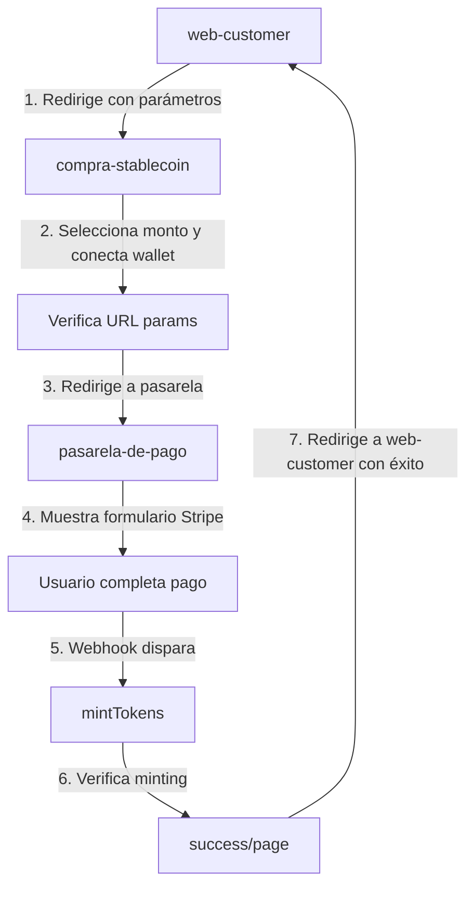

# Integración Consistente de Pagos con Stripe

## Resumen

Este documento describe la integración consistente entre `@stablecoin/compra-stablecoin` (frontend de compra) y `@stablecoin/pasarela-de-pago` (procesador de pagos), garantizando una experiencia de pago unificada con verificación adecuada del pago.

### Flujo de Pago Integrado



## Integración del Flujo de Pago

### 1. Parámetros URL Consistentes

Ambas aplicaciones utilizan un conjunto homogéneo de parámetros:

| Parámetro | Descripción | Fuente |
|-----------|-------------|--------|
| `amount` | Monto a pagar en euros | web-customer → compra-stablecoin → pasarela-de-pago |
| `walletAddress` | Dirección de la wallet del comprador | compra-stablecoin |
| `invoice` | Referencia única de la transacción | web-customer |
| `redirect` | URL de redirección tras pago exitoso | web-customer |

### 2. Pasarela de Pago (`@stablecoin/pasarela-de-pago`)

#### Creación de Payment Intent
- Recibe `amount`, `walletAddress`, y `invoice` en el body
- Crea orden en `orderStorage` con estos datos
- Retorna `clientSecret` para Stripe Checkout

#### Webhook de Stripe
- Al recibir `payment_intent.succeeded`:
  - Extrae `walletAddress`, `amount`, e `invoice` del metadata
  - Busca la orden correspondiente
  - Llama a `mintTokens()` → midea tokens directamente
  - Actualiza orden con `txHash`

### 3. Frontend de Compra (`@stablecoin/compra-stablecoin`)

#### Flujo de Compra
1. Recibe parámetros de URL (`amount`, `invoice`, `redirect`)
2. Al conectar wallet y seleccionar monto:
   - Redirige a `pasarela-de-pago` con todos los parámetros
3. Tras pago:
   - Página `/success` verifica minting
   - Redirige a `redirect` URL con resultados

#### Verificación Post-Pago
```typescript
// En success/page.tsx
const verifyMinting = async () => {
  const response = await fetch(
    `${PASARELA_URL}/api/verify-minting?invoice=${invoice}&wallet=${wallet}`
  );
  
  if (response.ok) {
    const data = await response.json();
    if (data.minted) {
      // Tokens minteados - redirigir con éxito
    }
  }
}
```

## Correcciones de Redirección Aplicadas

### Problema
La página de confirmación en `pasarela-de-pago` tenía una URL de redirección fija (localhost:3030), lo que rompía la integración con diferentes entornos.

### Solución Implementada
Se actualizó `stablecoin/pasarela-de-pago/src/app/confirmation/page.tsx` para:

1. Usar `NEXT_PUBLIC_WEB_CUSTOMER_URL` desde variables de entorno
2. Incluir parámetros de éxito en la redirección:
   - `?success=true`
   - `&amount=XXXX`
   - `&invoice=XXXX` (si existe)

```diff
-            href="http://localhost:3030"
+            href={`${process.env.NEXT_PUBLIC_WEB_CUSTOMER_URL || 'http://localhost:3030'}${status === 'succeeded' ? '?success=true&amount=' + amount + (invoice ? '&invoice=' + invoice : '') : ''}`}
```

Ahora la redirección es dinámica y proporciona retroalimentación al frontend de origen.

## Verificación de Estado de Pago

### Mecanismos de Verificación

1. **En Tiempo Real (webhook)**:
   - `mintTokens()` se llama directamente desde el webhook
   - No depende de APIs externas
   - Actualización inmediata de la orden

2. **Posterior (cliente)**:
   - Página `/success` verifica estado usando `/api/verify-minting`
   - Mecanismo de reintento (5 veces con 2s de delay)
   - Manejo adecuado de fallos

### API de Verificación

- **GET** `/api/verify-minting?invoice={invoice}&wallet={wallet}`
- Verifica si una orden específica se completó
- Retorna:
  ```json
  {
    "minted": boolean,
    "status": "completed" | "pending" | "expired",
    "txHash": string,
    "amount": number,
    "wallet": string,
    "invoice": string
  }
  ```

## Recomendaciones

1. **Variables de Entorno Compartidas**:
   - Asegurar que `NEXT_PUBLIC_WEB_CUSTOMER_URL` esté definido en ambos `.env`
   - Considerar un sistema de configuración centralizada

2. **Manejo de Errores**:
   - Mejorar la página de errores en `compra-stablecoin`
   - Añadir botón de reintentar en caso de fallo de verificación

3. **Seguimiento**:
   - Implementar logging estructurado
   - Considerar un sistema de monitoreo de pagos

Esta integración garantiza un flujo de pago consistente, verificación adecuada del estado del pago, y una experiencia de usuario coherente entre las aplicaciones.