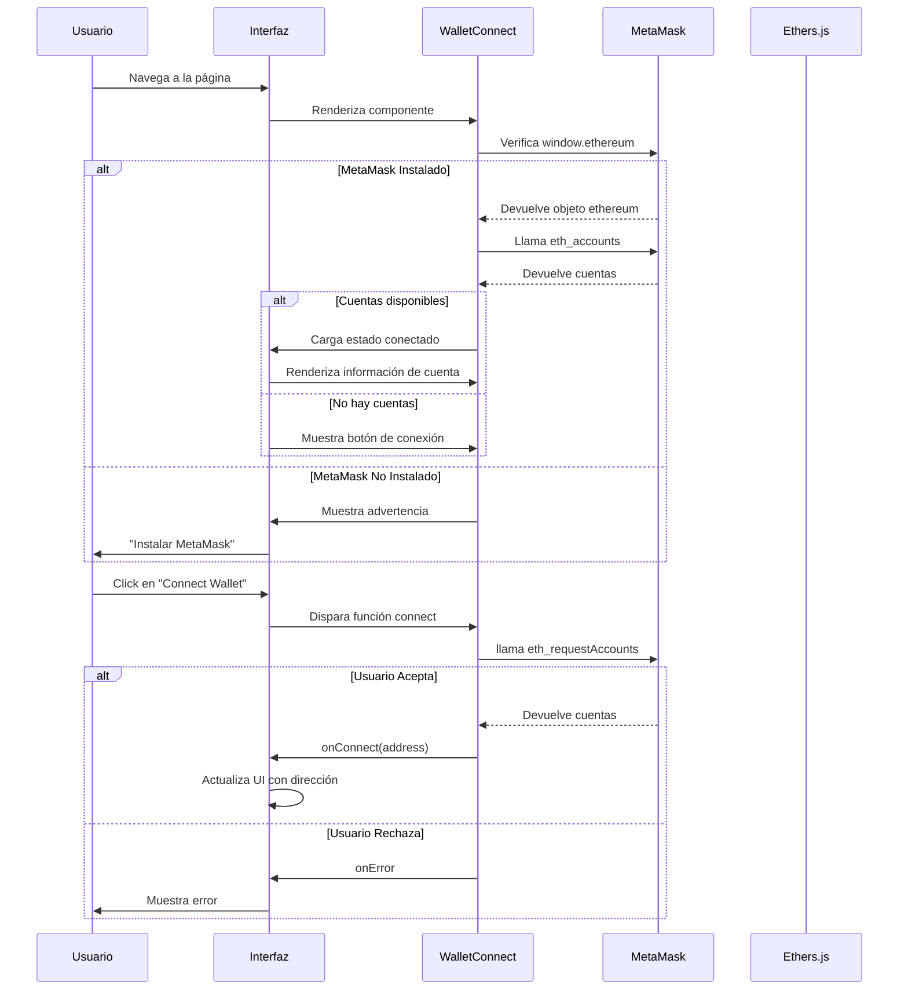
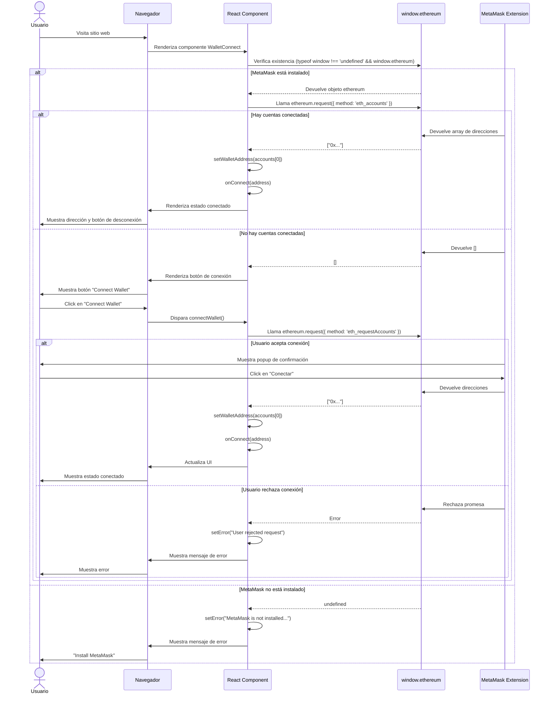

# Diagramas de la Aplicación

## Diagrama de Arquitectura

```mermaid
graph TD
    A[Usuario] --> B[Interfaz Web]
    B --> C[WalletConnect]
    B --> D[StatsCard]
    B --> E[TransactionList]
    C --> F[MetaMask]
    C --> G[Ethers.js]
    G --> H[Contrato Inteligente]
    G --> I[Anvil Node]
    H --> J[Blockchain]
    F --> G
    
    style A fill:#4a90e2,stroke:#333
    style B fill:#7ed321,stroke:#333
    style C fill:#f5a623,stroke:#333
    style D fill:#f5a623,stroke:#333
    style E fill:#f5a623,stroke:#333
    style F fill:#dd4b39,stroke:#333
    style G fill:#1c8db2,stroke:#333
    style H fill:#8b5cf6,stroke:#333
    style I fill:#8b5cf6,stroke:#332
    style J fill:#4a4a4a,stroke:#333
    
    click A "docs/ARCHITECTURE.md"
    click B "docs/ARCHITECTURE.md"
    click C "docs/API.md#walletconnect"
    click D "docs/API.md#statscard"
    click E "docs/API.md#transactionlist"
    click F "docs/WALLET.md"
    click G "docs/ETHEREUM.md"
    click H "docs/SMART_CONTRACT.md"
    click I "docs/ANVIL.md"
    click J "docs/BLOCKCHAIN.md"
```



## Diagrama de Flujo de Conexión



## Diagrama de Componentes

```mermaid
classDiagram
    class WalletConnect {
        +onConnect(address: string)
        +onDisconnect()
        -walletAddress: string | null
        -chainId: string | null
        -isConnecting: boolean
        -error: string | null
        +connectWallet(): Promise~void~
        +disconnectWallet(): void
        +formatAddress(address: string): string
    }
    
    class StatsCard {
        +title: string
        +value: string | number
        +description: string
        +trend?: 'up' | 'down' | 'neutral'
        +color?: 'primary' | 'success' | 'warning' | 'danger'
    }
    
    class TransactionList {
        +transactions: Transaction[]
        +getStatusColor(status: string): string
    }
    
    class Transaction {
        +id: string
        +user: string
        +amount: string
        +status: 'confirmed' | 'pending' | 'failed'
        +time: string
    }
    
    WalletConnect --> TransactionList : Usa en UI
    WalletConnect --> StatsCard : Usa en UI
    WalletConnect ..> MetaMask : Comunica via window.ethereum
    StatsCard --> TailwindCSS : Usa clases de estilos
    TransactionList --> TailwindCSS : Usa clases de estilos
    WalletConnect --> EthersJS : Usa para interacción Web3
    
    note "Componente principal de conexión con billeteras Web3" as WalletConnectNote
    WalletConnect .. WalletConnectNote
    
    note "Muestra métricas clave con indicadores visuales" as StatsCardNote
    StatsCard .. StatsCardNote
    
    note "Lista de transacciones recientes con estados" as TransactionListNote
    TransactionList .. TransactionListNote
```

## Diagrama de Secuencia - Conexión Exitosa



## Diagrama de Estados - WalletConnect

```mermaid
stateDiagram-v2
    [*] --> Disconnected
    
    state Disconnected {
        [*] --> NoMetaMask
        [*] --> ReadyToConnect
        
        state NoMetaMask {
            [*] --> DisplayError
            DisplayError: Muestra mensaje
            "MetaMask no instalado"
        }
        
        state ReadyToConnect {
            [*] --> DisplayButton
            DisplayButton: Muestra botón
            "Connect Wallet"
            DisplayButton --> Connecting: Click en botón
        }
        
        Connecting --> Connected: Conexión exitosa
        Connecting --> Error: Usuario rechaza
        Connecting --> Error: Error técnico
    }
    
    state Connected {
        [*] --> DisplayInfo
        DisplayInfo: Muestra dirección
        y estado de red
        DisplayInfo --> Disconnected: Click en "Disconnect"
    }
```

##